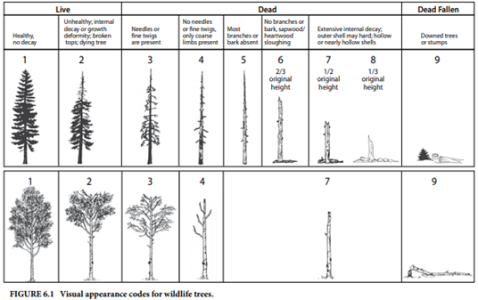

```{r global_options, include=FALSE}
knitr::opts_chunk$set(warning = FALSE, message = FALSE)
options(scipen = 999)
```

**This version does not include decay class 8.**

# Introduction

The loss of suitable trees for birds that nest in cavities of decaying trees (cavity-nesters) may be relevant for the Site C offset accounting framework. Data on decaying trees were collected at select locations as part of habitat data collection for the Breeding Bird Follow-up Monitoring program. Decaying trees are often referred to as "wildlife trees" in BC and that term is used to refer to the data that were collected. The wildlife tree data were used to estimate the density of decaying trees by habitat type and then extrapolated to the entire project footprint using ecosystem mapping data.

This document first describes the estimation of the number of decaying trees per hectare for various habitat types and then extrapolates to the entire Site C footprint to generate an estimate of the total number of decaying trees that may be lost to the project.

**NOTE: This document is an Rmarkdown notebook that includes R code, results, and text description. The R code is hidden by default. Individual blocks of code can be revealed using the "code" buttons wherever they occur. To show all code by default, use the pull-down menu in the top right.**

# Wildlife Tree Data

Two types of wildlife tree data were collected.

**WT50 -** This dataset includes the approximate total number of wildlife trees (live decaying trees and dead standing trees) greater than 15 cm diameter at breast height (d.b.h.) within 50m of plot centre. Trees were not identified to species. Data were collected at all bird survey locations in 2017, 2018 and 2019 (459 locations).

**WT11 -** This dataset includes the approximate total number of wildlife trees greater than 15 cm d.b.h. by species and decay class within 11.3 m of plot centre (400m2). This dataset was collected in 2018 and 2019 at woodpecker survey stations (318 locations), so there are fewer locations than the WT50 dataset.

The WT11 dataset was used in the analyses described below because the tree counts have higher accuracy than the WT11 dataset and are for the same plot area that the ecosystem unit was identified.

Wildlife trees were classified according to species and by the decay classes listed below. The SN11 dataset does not include class 1 (live tree with no decay).

**Wildlife tree decay classes:**\


# Ecosystem Attributes

Ecosystem classification and vegetation data were collected at each location that wildlife tree data was collected. Typical soil moisture regime (SMR) , stand composition and structural stage were used as model variables to estimate wildlife tree density.

# Decaying Tree Density Estimation

## Setup and Data Preparation

All data is in the accompanying file "wildlife_tree_data.xlsx".

```{r message=FALSE, warning=FALSE}
# Required Packages
library(here)
library(tidyverse)
library(readxl)
library(kableExtra)
library(MASS)
library(vcd)
library(visreg)
library(MuMIn) 
library(effects)
library(DHARMa)
library(emmeans)
library(broom)
library(ggpubr)

# Read and prepare data.
# Replace structural stage numbers with labels.
# "P-S" is Pole-sapling.
tree_dat <- 
  read_xlsx(here("cavity_trees", "dat", "wildlife_tree_data.xlsx"), 
                      sheet = "WT11_long") %>% 
  mutate(Structural_Stage = case_when(
    Structural_Stage == "2" ~ "Herb",
    Structural_Stage == "3" ~ "Shrub",
    Structural_Stage == "4" ~ "P-S",
    Structural_Stage == "5" ~ "Young",
    Structural_Stage == "6" ~ "Mature",
    Structural_Stage == "7" ~ "Old")
    ) %>% 
  mutate(Structural_Stage = 
           factor(Structural_Stage, 
           levels = c("Herb", "Shrub", "P-S", "Young", "Mature", "Old")),
         Stand_Composition = factor(Stand_Composition),
         SMR = factor(SMR, levels = c("dry", "mesic", "moist", "wet"))
         )

tree_dat <- tree_dat %>% 
  filter(!Decay_Class %in% c("Class8"))

```

## Basic Summary

### Number of Samples

Note:\
SMR = Soil Moisture Regime\
P-S = Pole/Sapling

```{r message=FALSE, paged.print=TRUE}
tree_dat %>% 
  group_by(Structural_Stage, SMR) %>% 
  summarize(n = n_distinct(HabDat_ID)) %>% 
  pivot_wider(names_from = "SMR", values_from = "n") %>% 
  dplyr::select(Structural_Stage, dry, mesic, moist, wet, "NA") %>% 
  kable(caption = "<strong>Table 1. Number of samples (plots) by structural stage and soil moisture regime</strong>") %>% 
  kable_styling(full_width = FALSE,
                position = "left")

tree_dat %>% 
  group_by(Stand_Composition) %>% 
  summarize(n = n_distinct(HabDat_ID)) %>% 
  kable(caption = "<strong>Table 2. Number of samples (plots) by stand composistion</strong>") %>% 
  kable_styling(full_width = FALSE,
                position = "left")

```

### Descriptive Stats

The boxplots below show (from inside out): median, first and third quartiles, minimum and maximum and outliers.

```{r message=FALSE}
tree_dat %>% 
  filter(Structural_Stage != "Herb") %>% 
  group_by(HabDat_ID, Structural_Stage, Stand_Composition) %>% 
  summarize(total_count = sum(Count)) %>% 
  ggplot() + 
  geom_boxplot(aes(x = Structural_Stage, y = total_count, colour = Stand_Composition)) +
  labs(subtitle = "Total Number of Decaying Trees by Structural Stage and Stand Composition",
       y = "Total number of wildlife trees per plot")
```

```{r message=FALSE}
tree_dat %>% 
  filter(Structural_Stage != "Herb") %>% 
  group_by(HabDat_ID, Structural_Stage, SMR) %>% 
  summarize(total_count = sum(Count)) %>% 
  ggplot() + 
  geom_boxplot(aes(x = Structural_Stage, y = total_count, colour = SMR)) +
  labs(subtitle = "Total Number of Decaying Trees by Structural Stage and SMR",
       y = "Total number of wildlife trees per plot")
```

## Model

Regression analysis was used to estimate the mean density of decaying trees.

### Number of Decaying Trees

The analysis below is for both coniferous and deciduous trees.

```{r message=FALSE, warning=FALSE, paged.print=TRUE}
# Sum trees of all decay classes for each station.
tree_total <- tree_dat %>% 
  filter(Structural_Stage != "Herb") %>% 
  droplevels() %>% 
  group_by(HabDat_ID, SMR, Stand_Composition, Structural_Stage) %>% 
  summarize(count_total = sum(Count))
```

Below is (1) a frequency histogram of all data and (2) a goodness of fit test for a negative binomial distribution. The data fits negative binomial distribution.

```{r message=FALSE, warning=FALSE}
hist(tree_total$count_total)  

fit_nbinom <- goodfit(tree_total$count_total, type = "nbinomial")
rootogram(fit_nbinom)
```

GLM with a negative binomial distribution was used. Model equations with all possible variations of the three explanatory variables were fit. The table below shows ranking of each model by AICc.

```{r}
model_nb_full <- glm.nb(count_total ~ Structural_Stage + SMR + Stand_Composition, 
                        data = tree_total,
                        na.action = "na.fail")
dredge(model_nb_full)
```

The model with the lowest AICc has SMR and structural stage, though not very different from the model with all three variables. It appears that stand composition has little influence on total number of decaying trees.

Models with interactions were attempted but could not be fit because there are not enough samples in the various combinations of variables to model interactions.

The outputs below provide a summary of the selected model, analysis of residuals and effects plots.

```{r paged.print=TRUE}
model_nb <- glm.nb(count_total ~ Structural_Stage + SMR, 
                        data = tree_total)
summary(model_nb)

# Simulate residuals to check model fit. 
simulationOutput <- simulateResiduals(fittedModel = model_nb, plot = T)

# Quick check
ae <- allEffects(model_nb)
plot(ae)
```

**Estimation of Decaying Tree Density**

Decaying tree density was estimated for each combination of SMR and structural stage.

Some of the combinations of SMR and structural stage do not exist, either in the wildlife tree data or as mapped ecosystems in the footprint (n = 3). So that we don't waste time on trying to interpret patterns for these cases that have not been measured AND are not in the footprint, they have been removed and do not show up in the plots.

```{r}
means_total_trees <- emmeans(model_nb, specs = c( "SMR", "Structural_Stage"), type = "response")
means_total_trees <- tidy(summary(means_total_trees)) %>%  
  arrange(SMR) %>% 
  mutate(SMR = factor(SMR, levels = c("dry", "mesic", "moist", "wet")),
         Structural_Stage = factor(Structural_Stage, levels = c("Shrub", "P-S", "Young", "Mature", "Old"))
         ) %>% 
  rename(total_trees = response) %>% 
  mutate(removal_flag = case_when(
    SMR == "wet" & Structural_Stage %in% c("Mature", "Old") ~ "not mapped in footprint",
    SMR == "dry" & Structural_Stage == "Old" ~ "not mapped in footprint",
    TRUE ~ "keep")
    ) %>% 
  filter(removal_flag == "keep")
write_csv(means_total_trees, here("cavity_trees", "out", "total_trees_estimates.csv"))
# Table not shown. Uncomment and run again to show.
# means_total_trees
```

```{r}
total_trees_plot <- means_total_trees %>% 
  ggplot(aes(x = Structural_Stage, y = total_trees, fill = SMR))+
  geom_bar(stat = "identity", width = 0.5, position = position_dodge())+
  labs(subtitle = "Estimated Number of Decaying Trees")+
  xlab(label = "Structural Stage") +
  ylab(label = "Decaying Tree Density (# / 400m2) with 95% CI")+
  geom_errorbar(aes(ymin = asymp.LCL, ymax = asymp.UCL), 
                width = 0.05,
                position = position_dodge(.5)
                ) +
  theme_bw() +
  theme(axis.title=element_text(size=10))
total_trees_plot
```

The highest estimated densities are in mesic sites and in young forest. It is interesting that the highest density is in young forest. Might logically think that older stands would have more dying trees. However this pattern could be explained by overall tree density: younger stands tend to have more stems than older stands. If we were estimating proportion of wildlife trees of all tree stems (living and dead), the pattern might be different.

### Number of Decaying Deciduous Trees

The section is the same analysis as completed, except for decaying deciduous trees only.

```{r}
# Using the summary data instead on this round.
tree_dat_sum <- 
  read_xlsx(here("cavity_trees", "dat", "wildlife_tree_data.xlsx"), 
                      sheet = "WT11_summary") %>% 
  mutate(Structural_Stage = case_when(
    Structural_Stage == "2" ~ "Herb",
    Structural_Stage == "3" ~ "Shrub",
    Structural_Stage == "4" ~ "P-S",
    Structural_Stage == "5" ~ "Young",
    Structural_Stage == "6" ~ "Mature",
    Structural_Stage == "7" ~ "Old")
    ) %>% 
  mutate(Structural_Stage = factor(Structural_Stage, 
                                   levels = c("Herb", "Shrub", "P-S", "Young", "Mature", "Old")),
         Stand_Composition = factor(Stand_Composition),
         SMR = factor(SMR, levels = c("dry", "mesic", "moist", "wet"))
         )

tree_dat_sum <- tree_dat_sum %>% 
  mutate(Decid_Tot = Decid_Tot - Decid_C6 - Decid_C7 - Decid_C8)
```

```{r message=FALSE, warning=FALSE, paged.print=TRUE}
tree_decid <- tree_dat_sum %>% 
  dplyr::select(HabDat_ID:BHC, Conif_Tot:Trees_Total) %>% 
  filter(Structural_Stage != "Herb") %>% 
  droplevels() %>% 
  group_by(HabDat_ID, SMR, Stand_Composition, Structural_Stage) %>% 
  summarize(count_total = sum(Decid_Tot))

hist(tree_decid$count_total)
```

```{r message=FALSE, warning=FALSE}
model_nb_full <- glm.nb(count_total ~ Structural_Stage + SMR + Stand_Composition, 
                        data = tree_decid,
                        na.action = "na.fail")
dredge(model_nb_full)
```

The model with the lowest AICc is the full model with SMR and stand composition . Models with interactions were attempted but could not be fit as there are not enough samples in the various combinations of variables to model interactions.

Model summary, analysis of residuals and quick look at effects are shown below.

```{r paged.print=TRUE}
model_nb <- glm.nb(count_total ~ Stand_Composition + SMR, 
                        data = tree_decid)
summary(model_nb)

# Simulate residuals to check model fit. 
simulationOutput <- simulateResiduals(fittedModel = model_nb, plot = T)

# Quick check
ae <- allEffects(model_nb)
plot(ae)
```

**Estimation of Decaying Deciduous Tree Density**

Decaying deciduous tree density was estimated for each combination of SMR, structural stage and stand composition.

As before, combinations that have not been measured AND are not in the footprint (n=6) have been removed and do not show up in the plots.

```{r}
means_total_decid <- emmeans(model_nb, specs = c( "SMR", "Stand_Composition"), type = "response")
means_total_decid <- tidy(summary(means_total_decid)) %>%  
  arrange(SMR) %>% 
  mutate(SMR = factor(SMR, levels = c("dry", "mesic", "moist", "wet"))) %>% 
  rename(total_trees = response)

# Table not displayed. Uncomment below to 
# means_total_decid
```

```{r}
decid_snags_plot <- means_total_decid %>%
  ggplot(aes(x = Stand_Composition, y = total_trees, fill = SMR))+
  geom_bar(stat = "identity", width = 0.5, position = position_dodge())+
  labs(subtitle = "Estimated Number of Deciduous Decaying Trees")+
  coord_cartesian(ylim=c(0,3.5)) +
  xlab(label = "Stand Composition") +
  ylab(label = "Density (# / 400m2) with 95% CI")+
  geom_errorbar(aes(ymin = asymp.LCL, ymax = asymp.UCL), 
                width = 0.05,
                position = position_dodge(.5)
                ) +
  theme_bw() +
  theme(axis.title=element_text(size=10))
decid_snags_plot

```

## Extrapolation to Entire Footprint

The total number of decaying trees in the footprint can be estimated by multiplying the density estimates by the area mapped in the footprint and summing across all categories.

The first step was to bring in the footprint ecosystem summary calculations and summarize area by SMR and structural stage for all trees and by SMR, stand composition and structural stage for deciduous trees only.

```{r message=FALSE}
footprint_eco <- 
  read_xlsx(here("cavity_trees", "dat", "wildlife_tree_data.xlsx"), 
                      sheet = "Footprint_CEM_EU") %>% 
  rename(Structural_Stage = `Structural Stage`)

footprint_eco_sum <- footprint_eco %>% 
  filter(Structural_Stage > 2 & `BEC Variant` == "BWBSmw1") %>% 
  filter(SMR != "NA") %>% 
  mutate(Structural_Stage = case_when(
    Structural_Stage == "3" ~ "Shrub",
    Structural_Stage == "4" ~ "P-S",
    Structural_Stage == "5" ~ "Young",
    Structural_Stage == "6" ~ "Mature",
    Structural_Stage == "7" ~ "Old")
    ) %>% 
  group_by(SMR, Structural_Stage, Stand_Composition) %>% 
  summarize(Area_Total = sum(`Total (ha)`))
```

The total area (hectares) of potential cavity nest habitat (shrub and forest) is: `r format(sum(footprint_eco_sum$Area_Total), 0)`

```{r message=FALSE, warning=FALSE}
tree_total_detail <- footprint_eco_sum %>% 
  group_by(SMR, Structural_Stage) %>% 
  summarize(Area_Total = sum(Area_Total)) %>% 
  left_join(means_total_trees, by = c("SMR", "Structural_Stage")) %>% 
  mutate(trees_per_ha = total_trees / 400 * 10000,
         footprint_trees = Area_Total * trees_per_ha,
         LCL = asymp.LCL / 400 * 10000 * Area_Total,
         UCL = asymp.UCL / 400 * 10000 * Area_Total) %>% 
  dplyr::select(SMR, Structural_Stage, trees_per_ha, Area_Total, footprint_trees, LCL, UCL)
tree_total_detail %>% 
  kable(caption = "<strong>Table 3. Estimated number of decaying trees in footprint</strong>", digits = 1) %>% 
  kable_styling(full_width = FALSE,
                position = "left")
```

**Total estimated number of decaying trees in footprint:** `r format(sum(tree_total_detail$footprint_trees, na.rm = TRUE), digits = 0)`\
**Lower Confidence Limit:** `r format(sum(tree_total_detail$LCL, na.rm = TRUE), digits = 0)`\
**Upper Confidence Limit:** `r format(sum(tree_total_detail$UCL, na.rm = TRUE), digits = 0)`

```{r echo=FALSE, message=FALSE, warning=FALSE}
decid_total_detail <- footprint_eco_sum %>% 
  group_by(SMR, Stand_Composition) %>% 
  summarize(Area_Total = sum(Area_Total)) %>% 
  left_join(means_total_decid) %>% 
  mutate(trees_per_ha = total_trees / 400 * 10000,
         footprint_trees = Area_Total * trees_per_ha,
         LCL = asymp.LCL / 400 * 10000 * Area_Total,
         UCL = asymp.UCL / 400 * 10000 * Area_Total) %>% 
  dplyr::select(SMR, Stand_Composition, trees_per_ha, Area_Total, footprint_trees, LCL, UCL)
decid_total_detail  %>% 
  kable(caption = "<strong>Table 4. Estimated number of deciduous decaying trees in footprint</strong>", digits = 1) %>% 
  kable_styling(full_width = FALSE,
                position = "left")
```

**Total estimated number of decaying deciduous trees in footprint:** `r format(sum(decid_total_detail$footprint_trees, na.rm = TRUE), digits = 0)`\
**Lower Confidence Limit:** `r format(sum(decid_total_detail$LCL, na.rm = TRUE), digits = 0)`\
**Upper Confidence Limit:** `r format(sum(decid_total_detail$UCL, na.rm = TRUE), digits = 0)`
